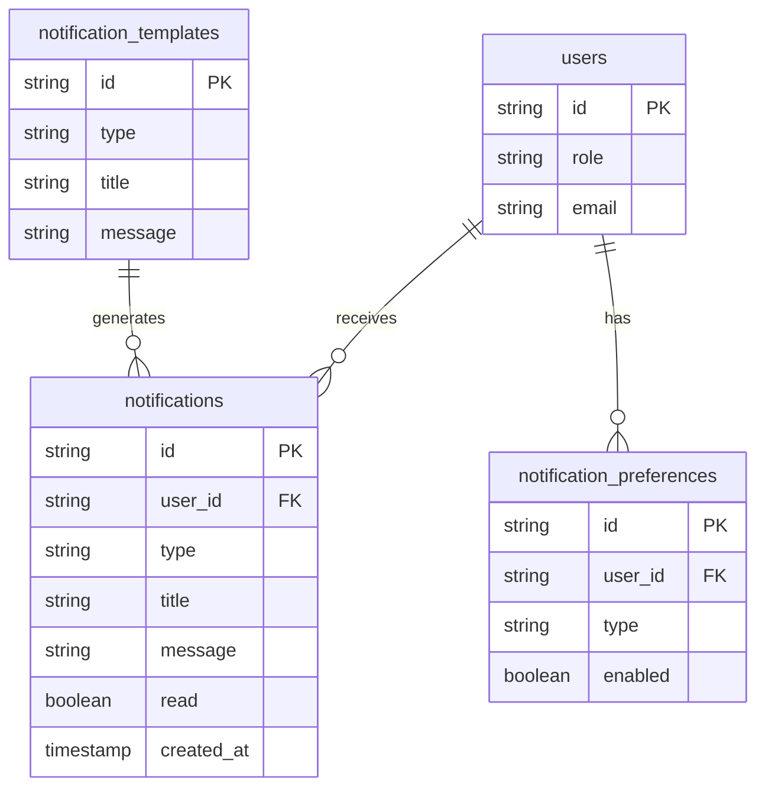

# Notification System Design Document

## Overview

The central notification system will provide real-time notifications for both admin and customer users through a bell icon interface and dedicated notifications page. The system will be built using Next.js 15, React 19, Drizzle ORM with PostgreSQL, and Server-Sent Events (SSE) for simple, efficient real-time delivery.

The system integrates seamlessly with the existing user management and lead management systems, providing contextual notifications based on user roles and system events.

## Architecture

### High-Level Architecture

```mermaid
graph TB
    A[Client Components] --> B[Notification API Routes]
    B --> C[Notification Service]
    C --> D[Database Layer]
    C --> E[SSE Connection Manager]
    E --> F[Real-time SSE Connections]
    
    G[Event Triggers] --> C
    H[Background Jobs] --> C
    
    subgraph "Client Layer"
        A1[Bell Icon Component with Badge]
        A2[Notification Dropdown]
        A3[Notifications Page]
        A4[Notification Preferences]
        A5[SSE Client Connection]
    end
    
    subgraph "API Layer"
        B1[/api/notifications]
        B2[/api/notifications/sse - SSE Endpoint]
        B3[/api/notifications/preferences]
        B4[/api/notifications/mark-read]
        B5[/api/notifications/unread-count]
    end
    
    subgraph "Service Layer"
        C1[NotificationService]
        C2[NotificationEventHandler]
        C3[NotificationTemplateEngine]
        C4[SSEConnectionManager]
    end
    
    subgraph "Data Layer"
        D1[notifications table]
        D2[notification_preferences table]
        D3[notification_templates table]
    end
```

### Technology Stack

- **Frontend**: React 19, Next.js 15, TypeScript, Tailwind CSS, Shadcn/ui
- **Backend**: Next.js API Routes, Server-Sent Events (SSE)
- **Database**: PostgreSQL with Drizzle ORM
- **Real-time**: Server-Sent Events (SSE) for efficient one-way real-time communication
- **Icons**: Lucide React (bell icon), Remixicon (notification types)
- **State Management**: React hooks with context for notification state

## Server-Sent Events (SSE) Integration

### SSE Connection Management

The SSE system will be implemented using Next.js API routes with a simple connection manager:

```typescript
// src/lib/sseConnectionManager.ts
export class SSEConnectionManager {
  private connections: Map<string, Set<Response>>; // userId -> Set of Response streams
  
  // Add user connection
  // Remove user connection
  // Broadcast to specific user
  // Broadcast to all users
  // Clean up closed connections
}

// src/app/api/notifications/sse/route.ts
// SSE endpoint for real-time notifications
// Authentication middleware for SSE connections
// Connection lifecycle management
```

### SSE Event Types

**Server → Client Events:**
- `notification` - New notification received
- `notification_read` - Notification marked as read
- `unread_count` - Updated unread count
- `connection_status` - Connection status updates
- `heartbeat` - Keep-alive ping

### Enhanced Badge System

The notification badge will feature:

1. **Visual Design**
   - Red circular badge with white text
   - Positioned at top-right of bell icon
   - Minimum size for single digits, expands for larger numbers
   - Shows "99+" for counts over 99

2. **Animations**
   - Pulse animation when new notifications arrive
   - Smooth fade in/out transitions
   - Bounce effect for urgent notifications
   - Badge disappears when count reaches 0

3. **Real-time Updates**
   - Instant updates via SSE events
   - Optimistic updates for better UX
   - Fallback to API polling if SSE fails

## Components and Interfaces

### Database Schema

```typescript
// New tables to add to schema.ts

export const notifications = pgTable('notifications', {
  id: text('id').primaryKey(),
  userId: text('user_id').notNull().references(() => users.id, { onDelete: 'cascade' }),
  type: text('type').notNull(), // 'user_registered', 'lead_converted', 'system_alert', etc.
  title: text('title').notNull(),
  message: text('message').notNull(),
  data: text('data'), // JSON payload for additional context
  read: boolean('read').default(false),
  readAt: timestamp('read_at'),
  actionUrl: text('action_url'), // Optional URL to navigate when clicked
  priority: text('priority').default('normal'), // 'low', 'normal', 'high', 'urgent'
  expiresAt: timestamp('expires_at'), // Optional expiration for temporary notifications
  createdAt: timestamp('created_at').$defaultFn(() => new Date()).notNull(),
}, (table) => ({
  userIdIdx: index('notifications_user_id_idx').on(table.userId),
  readIdx: index('notifications_read_idx').on(table.read),
  typeIdx: index('notifications_type_idx').on(table.type),
  createdAtIdx: index('notifications_created_at_idx').on(table.createdAt),
  priorityIdx: index('notifications_priority_idx').on(table.priority),
}));

export const notificationPreferences = pgTable('notification_preferences', {
  id: text('id').primaryKey(),
  userId: text('user_id').notNull().references(() => users.id, { onDelete: 'cascade' }),
  type: text('type').notNull(), // notification type
  enabled: boolean('enabled').default(true),
  emailEnabled: boolean('email_enabled').default(false),
  createdAt: timestamp('created_at').$defaultFn(() => new Date()).notNull(),
  updatedAt: timestamp('updated_at').$defaultFn(() => new Date()).notNull(),
}, (table) => ({
  userIdTypeIdx: index('notification_preferences_user_id_type_idx').on(table.userId, table.type),
}));

export const notificationTemplates = pgTable('notification_templates', {
  id: text('id').primaryKey(),
  type: text('type').notNull().unique(),
  title: text('title').notNull(),
  message: text('message').notNull(),
  defaultPriority: text('default_priority').default('normal'),
  roles: text('roles'), // JSON array of roles that should receive this notification
  createdAt: timestamp('created_at').$defaultFn(() => new Date()).notNull(),
  updatedAt: timestamp('updated_at').$defaultFn(() => new Date()).notNull(),
});
```

### TypeScript Interfaces

```typescript
// src/types/notification.ts

export interface Notification {
  id: string;
  userId: string;
  type: string;
  title: string;
  message: string;
  data?: any;
  read: boolean;
  readAt?: Date | null;
  actionUrl?: string | null;
  priority: 'low' | 'normal' | 'high' | 'urgent';
  expiresAt?: Date | null;
  createdAt: Date;
}

export interface NotificationPreference {
  id: string;
  userId: string;
  type: string;
  enabled: boolean;
  emailEnabled: boolean;
  createdAt: Date;
  updatedAt: Date;
}

export interface NotificationTemplate {
  id: string;
  type: string;
  title: string;
  message: string;
  defaultPriority: 'low' | 'normal' | 'high' | 'urgent';
  roles?: string[];
  createdAt: Date;
  updatedAt: Date;
}

export interface CreateNotificationRequest {
  userId?: string;
  userIds?: string[];
  type: string;
  title?: string;
  message?: string;
  data?: any;
  actionUrl?: string;
  priority?: 'low' | 'normal' | 'high' | 'urgent';
  expiresAt?: Date;
}

export interface NotificationListResponse {
  notifications: Notification[];
  unreadCount: number;
  pagination?: {
    page: number;
    perPage: number;
    total: number;
    hasNext: boolean;
  };
}
```

### Core Components

#### 1. NotificationBell Component
```typescript
// src/components/notifications/NotificationBell.tsx
// - Bell icon with animated badge showing unread count
// - Real-time badge updates via SSE
// - Badge styling: red circle with white text, positioned top-right
// - Badge animations: pulse effect for new notifications
// - Dropdown with recent notifications
// - Click handlers for navigation and mark as read
```

#### 2. NotificationDropdown Component
```typescript
// src/components/notifications/NotificationDropdown.tsx
// - Shows 5 most recent notifications
// - Mark as read functionality
// - "View All" link to notifications page
// - Empty state when no notifications
```

#### 3. NotificationsPage Component
```typescript
// src/app/notifications/page.tsx
// - Full list of notifications with pagination
// - Filter by type, read status
// - Bulk actions (mark all as read)
// - Search functionality
```

#### 4. NotificationPreferences Component
```typescript
// src/components/notifications/NotificationPreferences.tsx
// - Toggle switches for different notification types
// - Email notification preferences
// - Save preferences functionality
```

## Data Models

### Notification Types

The system will support the following notification types:

**Admin Notifications:**
- `user_registered` - New user registration
- `lead_converted` - Lead converted to customer
- `lead_assigned` - Lead assigned to admin
- `system_cleanup_completed` - Cleanup operations completed
- `user_banned` - User banned/unbanned
- `system_error` - Critical system errors
- `bulk_action_completed` - Bulk operations completed

**Customer Notifications:**
- `account_updated` - Profile updated by admin
- `account_status_changed` - Account status changes
- `lead_status_updated` - Lead status changes (if applicable)
- `system_maintenance` - Maintenance announcements
- `welcome` - Welcome message for new users

### Notification Priority Levels

- **Low**: General information, non-urgent updates
- **Normal**: Standard notifications, default priority
- **High**: Important updates requiring attention
- **Urgent**: Critical alerts requiring immediate action

### Data Relationships



## Error Handling

### Client-Side Error Handling

1. **SSE Connection Failures**
   - Automatic reconnection with exponential backoff
   - Fallback to polling when SSE unavailable
   - User notification of connection status

2. **API Request Failures**
   - Retry logic for failed requests
   - Toast notifications for user feedback
   - Graceful degradation when offline

3. **Component Error Boundaries**
   - Wrap notification components in error boundaries
   - Fallback UI when components fail
   - Error reporting for debugging

### Server-Side Error Handling

1. **Database Errors**
   - Transaction rollbacks for failed operations
   - Logging of database errors
   - Graceful error responses to client

2. **SSE Stream Errors**
   - Connection cleanup on client disconnect
   - Error logging for debugging
   - Automatic client reconnection handling

3. **Notification Creation Failures**
   - Queue failed notifications for retry
   - Log notification creation errors
   - Fallback to email notifications when possible

## Testing Strategy

### Unit Tests

1. **Service Layer Tests**
   - NotificationService methods
   - Event handler functions
   - Template rendering logic
   - Database operations

2. **Component Tests**
   - NotificationBell rendering and interactions
   - NotificationDropdown functionality
   - Preferences component state management
   - Error boundary behavior

3. **API Route Tests**
   - Notification CRUD operations
   - SSE endpoint functionality
   - Authentication and authorization
   - Error response handling

### Integration Tests

1. **End-to-End Notification Flow**
   - Create notification → Real-time delivery → Mark as read
   - User preference changes affecting notifications
   - Role-based notification filtering

2. **Real-time Communication Tests**
   - SSE connection establishment
   - Multiple client connections
   - Connection recovery scenarios

3. **Database Integration Tests**
   - Notification queries with proper indexing
   - Preference updates and retrieval
   - Template-based notification creation

### Performance Tests

1. **Load Testing**
   - Multiple concurrent SSE connections
   - High-volume notification creation
   - Database query performance under load

2. **Memory Usage**
   - SSE connection memory consumption
   - Client-side notification state management
   - Server-side connection tracking

## Security Considerations

### Authentication and Authorization

1. **User-Specific Notifications**
   - Verify user can only access their notifications
   - Role-based notification type filtering
   - Secure SSE connection authentication

2. **API Security**
   - JWT token validation for all endpoints
   - Rate limiting on notification creation
   - Input validation and sanitization

### Data Privacy

1. **Sensitive Information**
   - Avoid storing sensitive data in notification messages
   - Encrypt notification data if necessary
   - Proper data retention policies

2. **Cross-User Data Leakage**
   - Strict user ID validation
   - Prevent notification data exposure between users
   - Audit logging for notification access

## Performance Optimization

### Database Optimization

1. **Indexing Strategy**
   - Composite indexes for common query patterns
   - Separate indexes for filtering and sorting
   - Regular index performance monitoring

2. **Query Optimization**
   - Pagination for large notification lists
   - Efficient unread count queries
   - Batch operations for bulk actions

### Real-time Performance

1. **SSE Optimization**
   - Efficient connection management and cleanup
   - Memory-efficient user connection tracking
   - Automatic reconnection with exponential backoff
   - Connection heartbeat for reliability

2. **Client-Side Performance**
   - Debounced API calls
   - Efficient state updates
   - Virtual scrolling for large lists

### Caching Strategy

1. **Server-Side Caching**
   - Cache notification templates
   - Cache user preferences
   - Redis for session-based caching

2. **Client-Side Caching**
   - Cache recent notifications
   - Optimistic updates for better UX
   - Background refresh strategies